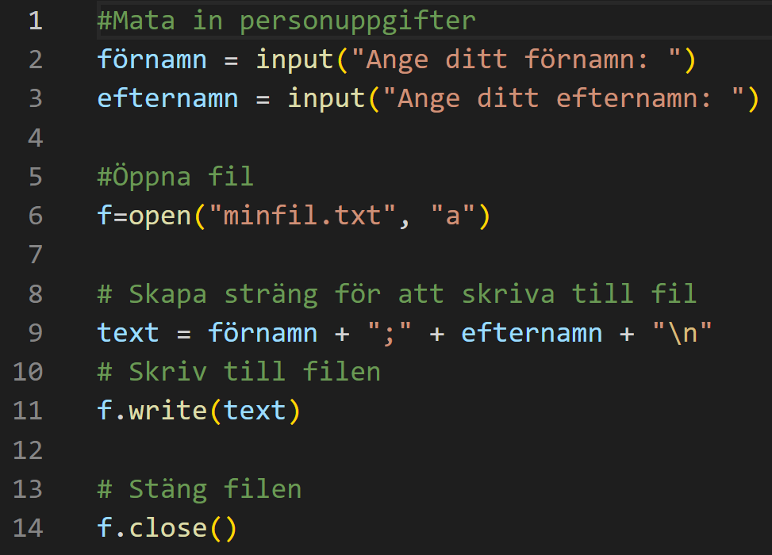
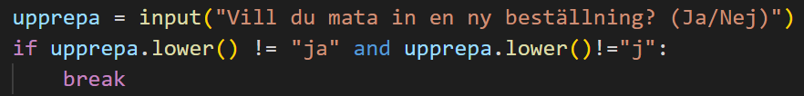

# Uppgift: Filhantering i Python

Du arbetar som utvecklare åt ett företag som säljer sportartiklar. Företaget har en webbshop där kunder kan beställa produkter. Din uppgift är att skriva ett Python-program som hanterar kundbeställningar och lagrar dem i en fil.

## Programmet ska fungera på följande sätt:

1. När programmet startar ska det fråga användaren efter kundens namn och e-postadress.
2. Programmet ska sedan fråga användaren efter vilken produkt som kunden vill beställa och hur många av den produkten.
3. Programmet ska lägga till kundens beställning i en fil som heter "orders.txt".
4. Filen ska ha följande format:
    * En rad per beställning.
    * Raden ska innehålla kundens namn, e-postadress, produktens namn och antal separerade med semikolon.
5. Programmet ska sedan fråga användaren om denne vill fortsätta lägga till fler beställningar. Om användaren svarar "Ja" så går programmet tillbaka till steg 1. Om användaren svarar "Nej" så avslutas programmet.
6. Ifall du hinner färdigt lägger du in ytterligare ett alternativ där man kan välja att läsa innehållet i filen "orders.txt" och skriva ut det på skärmen.

### Nedan är ett exempel på hur filen "orders.txt" skulle kunna se ut:
    John Andersson;john.andersson@gmail.com;Löparskor;2
    John Andersson;john.andersson@gmail.com;Tennisracket;1
    Jane Hjort;jane.hjort@gmail.com;Fotboll;1

### Exempel på delar av grundkod

### För att avsluta en while-sats
